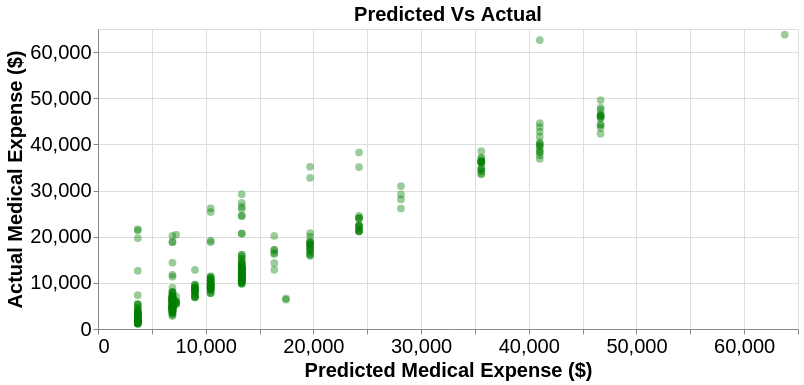
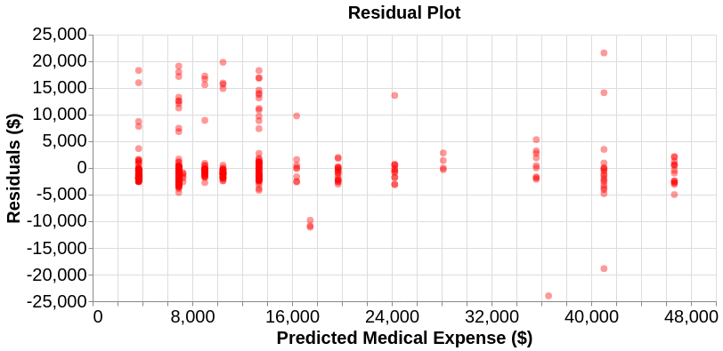

```{r setup, include=FALSE}
knitr::opts_chunk$set(echo = FALSE, warning = FALSE, message=FALSE)
library(feather)
library(tidyverse)
library(knitr)
library(caret)
library(ggridges)
library(ggthemes)
theme_set(theme_minimal())
set.seed(123)

```


```{r load data}
regression_error <- read.csv("../reports/tables/regression_errors.csv")

```


# Summary

Knowing the estimated medical expenses in advance is very critical for insurance companies to set their yearly premiums to beneficiaries. They should make sure that the amount they spent on beneficiaries is less than the total premium they receive. Using a predictive model that predicts the expected medical expense of a customer, the insurance companies get an estimate of how much premium to charge on each segment of customers such that the cost results in reasonable profit to the company. Using such predictive models, they can identify potentially high-risk customers and charge a higher premium from such customers. In this project, we attempt to build a regression model that will help us predict the medical expenses of a person given information such as age, sex, number of children, smoking habits, and the region where the person is from. In the process, we are also interested in figuring out if there is a significant difference in expenses between smokers and non-smokers, and between males and females. Our hypothesis tests suggest that at 0.05 significance level there is significant evidence to conclude that smokers incur more medical expenses than non-smokers. Also, there is enough evidence to conclude that the medical expenses of men and women are different at a 5% significance level. For our predictive model, after trying different regression models, we found that the decision tree regressor performs the best on our data. Using our final tuned model, we achieved satisfying results on the test data set, with a score of 0.894. 

# Introduction

In this project, we attempt to build a predictive model that will answer the following question: "Given a person's information, what would be his/her predicted medical expenses?". Answering this question can be important for insurance companies to set the insurance premium based on the risk associated with each customer.  

We also wanted to figure out if there is a significant difference in expenses between smokers and non-smokers, and between males and females. Therefore, we considered two inferential studies in order to answer those questions.

# Data
The Data we are using for this analysis is used in the book Machine Learning with R by Brett Lantz[@source]; which is a book that provides an introduction to machine learning using R. All of these datasets are in the public domain. The data explain the cost of a small sample of USA population Medical Insurance Cost based on attributes like age, sex, number of children etc. Additional information about this data can be found [here](https://gist.github.com/meperezcuello/82a9f1c1c473d6585e750ad2e3c05a41).

We didn't have to clean this data because there were no outliers or missing values, as described in [this](https://github.com/UBC-MDS/DSCI_522_group_401/blob/master/notebooks/EDA.ipynb) jupyter notebook.

The R and Python programming languages [@R] [@Python] and the following R and Python packages were used to split the data and study the missing values and the outliers : docopt [@docopt], tidyverse[@tidyverse], testthat [@testthat], pandas [@mckinney-proc-scipy-2010], numpy [@doi:10.1109/MCSE.2011.37], matplotlib and seaborn [@Hunter:2007].


# Methodology  
## Exploratory analysis on the training data set 

To understand the nature of predictors with respect to `Medical Expenses` we will perform Exploratory Data Analysis and we will try to understand if there are some interesting behaviors. To do so, we will use the following python packages :  altair [@Altair2018], matplotlib and seaborn [@Hunter:2007], scikit-learn [@scikit-learn].
For this exploratory analysis, we decided to gather the different BMI into 4 categories in order to make our plots more readable and more relevant. For 4 categories are the following : 

  - underweight : under 18.5 kg/$\text{m}^2$
  - normal : 18.5 to 25 kg/$\text{m}^2$
  - overweight : 25 to 30 kg/$\text{m}^2$
  - obese : over 30 kg/$\text{m}^2$
 

##### 1. Let's see how `Medical Expenses` are changing with `Age` 


<center> *Figure 1 : Expenses VS Age* </center>


It can be observed that the `Medical Expense` of people is increasing, as `Age` increases.

##### 2. Let's see how  `Medical Expenses` are changing with `BMI (Body Mass Index)`


<center> Figure 2 : Expenses VS BMI* </center>


The highest expenses seem to occur for people who have a higher BMI.

##### 3. Let's see how much money males and females spending on medical treatments between 18-64 Years


<center> *Figure 3 : Expenses_VS_Gender* </center>


The expenses seem to grow with age for both males and females. It looks like Males in their **20's & 60's** tend to pay more on their `Medical Expenses` than Females. Females in their **40's** are paying more than Males on their `Medical Expenses`.


##### 4. Let's see how `Smokers` and `Non-Smokers` are spending on medical treatments between 18-64 Years

We expect expenditures by smokers should be higher than non-smokers.


<center> *Figure 4 : Expenses VS Smoker*</center>


**Interesting!!!** - As expected, health expenses of smokers are a lot higher than that of non-smokers.

##### 5. Let's see the male & female expenses over BMI


<center> *Figure 5 : Expenses VS BMI and Sex* </center>

The highest expenses seem to occur for people from both genders who have a BMI that is higher than 34.

##### 6. Correlation between the variables


<center> *Figure 6 : Correlation heatmap* </center>

We can notice that none of the features seem to be correlated with each other. Hence, the features don't seem to be relevant individually.

## Answering the Inferential Research Questions 

Now, from above Exploratory Data Analysis we are interested in following two questions:

  - Are medical expenses of smokers are statistically higher than non-smokers? 
  - Is there a significant statistical difference in expenses between males and females?
<br> 

##### 1. Are medical expenses of smokers are statistically higher than non-smokers?

$$H_0: \mu_{Smokers} \leq \mu_{Non-Smokers}$$
$$H_1: \mu_{Smokers} > \mu_{Non-Smokers}$$

Our null hypothesis states that the mean expense of smokers is less than equal to the mean expense of non-smokers and alternate hypothesis states that the expenses of smokers are higher than the expenses of non-smokers. We have used a One Sample t-test:


```{r}
hypothesis_1 <- readr::read_csv('../reports/tables/1.hypothesis_smokers.csv')
kableExtra::kable(hypothesis_1)
```

<center> *Figure 7 : Results of the test for the expenses of smokers VS non-smokers* </center>


The exact p-value is $`r hypothesis_1$p.value`$ which is very close to 0. However, while rendering the output to the table above it treats it as 0.

We can observe that the p-value is less than the significance level of $5\%$. Hence, we can reject $H_0$ hypothesis and conclude that we have enough evidence to say the mean expenses of smoker is higher than the mean expenses of non-smokers.

##### 2. Is there a significant statistical difference in expenses between males and females?

$$H_0: \mu_{Males} = \mu_{Females}$$
$$H_1: \mu_{Males} \neq \mu_{Females}$$

Our Null hypothesis states that the mean expenses of males are equal to mean expenses of females and Alternate hypothesis states that there is a significant difference between these two quantities. We have used t-test to compare the mean of two groups and test results are as following:

```{r }
hypothesis_2 <- readr::read_csv('../reports/tables/2.hypothesis_sex.csv')
kableExtra::kable(hypothesis_2)
```

<center> *Figure 8 : Results of the test for the expenses of males VS females* </center>


The exact p-value is $`r hypothesis_2$p.value`$ which is less than the significance level of $5\%$ hence, we can reject $H_0$ hypothesis and conclude that we have enough evidence to say mean expenses between Males and Females is not same. 

## Build a predictive model 
```{r load data analysis}
models <- read.csv("../reports/tables/regression_models_base_errors.csv")
model_names <- c(colnames(models))
model_names <- model_names[2 : length(model_names)]
```

In this data analysis project, we primarily focus on predicting the medical expenses given the details of a customer. We used Python for building the machine learning model. The machine learning library, `sci-kit learn` was extensively used in this project to transform the data, feature engineering, feature selection, model selection, hyper-parameter tuning and, model evaluation.

### Preprocessing
Firstly, the training data was loaded and the response variable was separated from the training data. Then numerical and categorical features in the data are identified. A summary of various feature transformations done on the categorical and numerical features are given below.

```{r feature transformations}
transformations <- read.csv("../reports/tables/preprocessors.csv")
transformations <- transformations %>%
                    select(Numeric.features, Categorical.features)
kableExtra::kable(transformations)
```

<center> *Figure 9 : summary of the feature transformations* </center>


### Model Selection

In our project, the target variable is a continuous/numeric variable. We can use regression methods to predict a continuous response variable. Here, in model selection, we are comparing different regression algorithms such as Linear Regression, Decision Tree, KNN Regression and Random Forest Regression. After preprocessing and feature transformation, the above regression models are fitted on the training data with the default parameters. A model with the best performance on the training and validation dataset is selected for hyper-parameter optimization. A summary of baseline performance by various regression models is given below.

```{r model selection}
model_base <- read.csv("../reports/tables/regression_models_base_errors.csv")
model_base <- model_base %>% rename("Error Metrics"=X )
kableExtra::kable(model_base)
```

<center> *Figure 10 : summary of baseline performance by various regression models* </center>


Based on the above scores, DecisionTreeRegressor was selected as the final model and hyper-parameter tuning was done on it. In the data analysis pipeline, the selection of the model from the base models is currently done manually. We decided to choose  DecisionTreeRegressor because of its low training and validation score. All other models have considerable under-fit whereas the  DecisionTreeRegressor was over-fitting on the training data. Decision tree models require less preprocessing of the data compared to other models. Also, decision tree models are more interpretable than ensemble-based models such as Random Forest and Gradient Boosted Decision Trees. We decided to address the over-fit issues in the  DecisionTreeRegressor during the hyper-parameter tuning. The hyper-parameters `min_samples_split` and `max_depth` are chosen to address the over-fitting issue. 

### hyper-parameter tuning
Hyper-parameter optimization was performed using `GridSearchCV`. The best parameters obtained from hyper-parameter optimization are given below.

```{r  hyper-parameter tuning}
hp <- read.csv("../reports/tables/hyperparameters.csv")
hp <- hp %>% rename("Hyper-parameter"=X)
kableExtra::kable(hp)
```

<center> *Figure 11 : best parameters obtained from hyper-parameter optimization* </center>


# Results 

###  model evaluation on train and test dataset
The final tuned DecisionTreeRegressor model was evaluated on both the training and test data using various regression metrics. A summary of the results is shown below.
```{r  model evaluation}
results <- read.csv("../reports/tables/regression_errors.csv")
results <- results %>% rename("Evaluation Metric"=X)

# Mean absolute error on test data
mae <- results %>%
  select(test_data) %>%
  slice(1)

# Mean squared error on test data
mse <- results %>%
  select(test_data) %>%
  slice(2)

# Root mean squared error
rms <- results %>%
  select(test_data) %>%
  slice(3)

# r2
r2 <- results %>%
  select(test_data) %>%
  slice(4)

# explained variance score
evs <- results %>%
  select(test_data) %>%
  slice(5)

# Mean expense on test data
test_data <- read.csv("../data/processed/medical_cost_data_test.csv")
mean_exp <- test_data %>%
  pull() %>%
  mean()

kableExtra::kable(results)
```

<center> *Figure 12 : model evaluations on train and test data* </center>


We used several regression metrics for evaluating our model. Firstly, we used mean absolute error, which is the average of the absolute values of the difference between predicted expenses and actual expenses. For our predictive model, we got a mean absolute error of `r mae`. Although it seems like a high error, considering the mean medical expense of `r mean_exp`, we are not very far from predicting the accurate expenses. Secondly, we used the mean squared error as the evaluation metric. For our final model, we got a mean squared error of `r mse`. The mean squared error is much higher than mean absolute error because the former is the average of the sum of the squares of the differences between the predicted expenses and actual expenses. This metric cannot be compared directly to mean absolute error because both the metrics have different units of measurement. Then we used root mean squared error, which is the square root of the mean squared error. We got a root mean squared error of `r rms`. We can compare this metric directly to the mean absolute error. However, the root means square penalizes the model more for making larger errors. Choosing the right metric between these two to report the model performance often requires domain knowledge and depends on how the predicted values are used in real life.  

The last two metrics we used to report our model performance rely on the capability of our models to explain the variance of the response variable. $R^2$ score of `r r2` means our model explains `r r2*100` % of the variance in the response variable. This is pretty good as the model is able to explain most of the variance in the medical expenses in the test dataset. However, we can not rely entirely on $R^2$ score to conclude on the performance of our model. It should always be compared with the residual plot, which is shown in the next section of this report. Our final metric, explained variance score, is very similar to the $R^2$ score. If the expected value of the error terms is zero, both these metrics are exactly the same. In our model, we got these metrics almost the same, indicating that the mean value of the error is close to zero.   

### Goodness of fit
```{r  plot_predict_vs_actual}

  
```

<center> *Figure 13 : Predicted VS actual values* </center>


```{r  plot_residual}


```

<center> *Figure 14 : Plot of the residuals* </center>


From the residual plot above, we can see that the model is accurate in predicting the expenses of most of the samples in the test dataset. There are more points on the positive side than the negative side. This indicates that our model is underestimating more often than overestimating when making an error. Overall the model does a pretty decent job of predicting the medical expenses given the patient information. 

# Limitations and Future Directions

The model that we built for predicting the medical expenses only serves as a baseline. The limitations are mainly due to the data. We have a very small dataset with very few features. For building a deployment-ready model for practical applications we need to collect more data. Apart from this, we can improve the model by performing feature engineering. In this project, no new features were created apart from polynomial features and one-hot-encoded features. With some research on the domain, we can come up with entirely new features or we can combine existing features to get new features. Also, we haven't done any feature selection in this project. Data collection and feature engineering are the most critical steps in building any machine earning product. However, due to the limited time available, we could not allocate sufficient resources for feature engineering. Moreover, we haven't performed model selection and hyper-parameter tuning in this project. SO there is a lot of scope for future works in this project.  Overall, this serves as a very good base model on which further improvements can be made.

# References 

