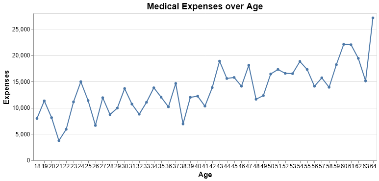
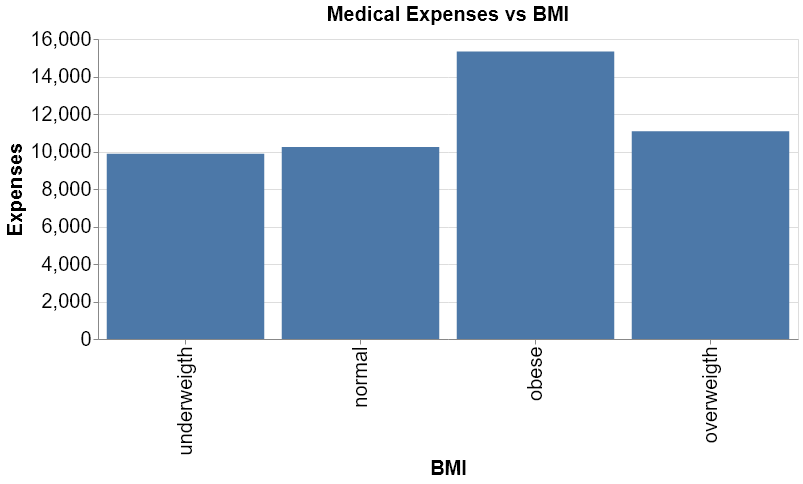
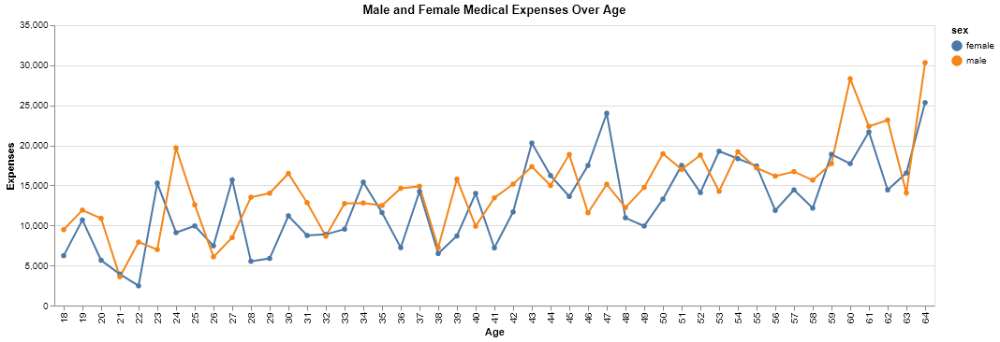
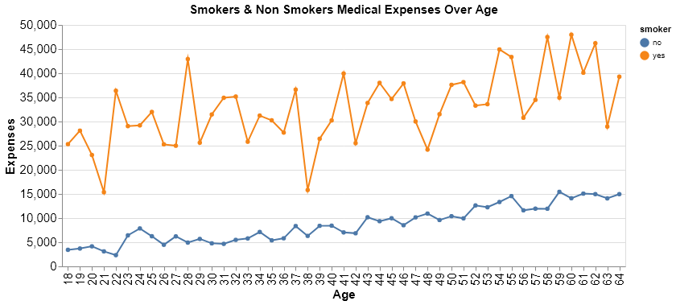
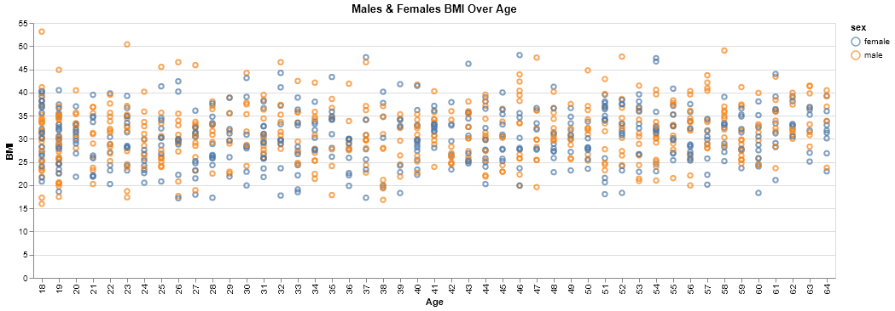
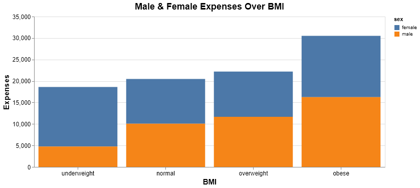

Medical Expense Data Analysis and Predictive Modeling
================
author: Karanpal Singh, Sreejith Munthikodu, Sirine Chahma  
2020/01/24

# Summary

In this project, we attemps to build a regression model that will help
us predict the medical expenses of a person regarding some information
about this person (age, sex, number of children, if the person smokes
and the region where the person is from). After trying different types
of regressors (linear regression, decision tree regressor, knn
regression, random forest regression and SVR), we found out that the
decision tree regressor ended up being the best model regarding to our
data. Our final regressor had satisfying results on an unseen data set,
with a  score of
0.826 on our test data set.

# Introduction

In this project, we attempt to build a predictive model that will answer
the following question : “Given a person’s information, what would be
his/her predicted medical expenses?”. Ansewering this question can be
important for insurance compagnies who wants to evaluate the risk to
insure a certain person regarding to his/her possible medical expenses.

We also wanted to figure out if there is a significant difference of
expenses between smokers and non-smokers, and between males and females.
Therefore, we led two inferential studies asside in order to find an
aswer to those questions.

# Methods

## Data

The Data we are using for this analysis is used in the book Machine
Learning with R by Brett Lantz(Lantz 2013); which is a book that
provides an introduction to machine learning using R. All of these
datasets are in the public domain. The data explain the cost of a small
sample of USA population Medical Insurance Cost based on attributes like
age, sex, number of children etc. Additional information about this data
can be found
[here](https://gist.github.com/meperezcuello/82a9f1c1c473d6585e750ad2e3c05a41).

We didn’t have to clean this data because there were no outliers or
missing values, as described in
[this](https://github.com/UBC-MDS/DSCI_522_group_401/blob/master/notebooks/EDA.ipynb)
jupyter notebook.

The R and Python programming languages (R Core Team 2019) (Van Rossum
and Drake 2009) and the following R and Python packages were used to
split the data and study the missing values and the outliers : docopt
(de Jonge 2018), tidyverse(Wickham 2017), testthat (Wickham 2011),
pandas (McKinney 2010), numpy (Walt, Colbert, and Varoquaux 2011),
matplotlib and seaborn (Hunter 2007).

## Exploratory analysis on the training data set

To understand the nature of predictors with respect to `Medical
Expenses` we will perform Exploratory Data Analysis and we will try to
understand if there are some intresting behaviours. To do so, we will
use the following python packages : altair (VanderPlas et al. 2018),
matplotlib and seaborn (Hunter 2007), scikit-learn (Pedregosa et al.
2011).

##### 1\. Let’s see how `Medical Expenses` are changing with `Age`

<html>

</html>

It can be observed that `Medical Expense` of people is increasing, as
`Age`
increases.

##### 2\. Let’s see how `Medical Expenses` are changing with `BMI (Body Mass Index)`

<html>

</html>

The highest expenses seem to occur for people who have a higher
BMI.

##### 3\. Let’s see how much money males and females spending on medical treatments between 18-64 Years

<html>

</html>

The expenses seem to grow with age for both males and females. It looks
like Males in their **20’s & 60’s** tend to pay more on their `Medical
Expenses` than Females. Females in their **40’s** are paying more than
Males on their `Medical
Expenses`.

##### 4\. Let’s see how `Smokers` and `Non-Smokers` are spending on medical treatments between 18-64 Years

We expect expenditures by smokers should be higher than the non smokers.

<html>

</html>

**Interesting\!\!\!** - As expected, Health expenses of smokers are a
lot higher than the one of non-smokers.

##### 5\. Let’s see how `BMI` is changing with Age for Males and Females

We are expecting both male and females have usual `BMI`.

<html>

</html>

The `BMI` doesn’t seem to vary depending on the age nor the sex.

##### 6\. Let’s see the Male & Female Expenses Over BMI

<html>

</html>

The highest expenses seem to occur for people from both genders who have
a BMI that is higher than 34.

## Answering the Inferential Research Questions

Now, from above Exploratory Data Analysis we are interested in following
two questions:

  - Is there a significant difference of expenses between smokers and
    non-smokers?
  - Is there a significant difference of expenses between males and
    females?

 

##### 1\. Is there a significant difference of expenses between smokers and non-smokers?

  
  
  
  

Our Null hypothesis states that mean expenses of smokers is equal to
mean expenses of non-smokers and Alternate hypothesis states that there
is a significant difference between these two quantities. We have used
t-test to compare mean of two groups and test results are as following:

<table>

<thead>

<tr>

<th style="text-align:right;">

estimate

</th>

<th style="text-align:right;">

estimate1

</th>

<th style="text-align:right;">

estimate2

</th>

<th style="text-align:right;">

statistic

</th>

<th style="text-align:right;">

p.value

</th>

<th style="text-align:right;">

parameter

</th>

<th style="text-align:right;">

conf.low

</th>

<th style="text-align:right;">

conf.high

</th>

<th style="text-align:left;">

method

</th>

<th style="text-align:left;">

alternative

</th>

</tr>

</thead>

<tbody>

<tr>

<td style="text-align:right;">

\-23615.96

</td>

<td style="text-align:right;">

8434.268

</td>

<td style="text-align:right;">

32050.23

</td>

<td style="text-align:right;">

\-32.75189

</td>

<td style="text-align:right;">

0

</td>

<td style="text-align:right;">

311.8511

</td>

<td style="text-align:right;">

\-25034.71

</td>

<td style="text-align:right;">

\-22197.21

</td>

<td style="text-align:left;">

Welch Two Sample t-test

</td>

<td style="text-align:left;">

two.sided

</td>

</tr>

</tbody>

</table>

The exact p-value is
 which is very close to 0. However, while
rendering the output to the table above it treats it as 0.

As, we can observe that the p-values is less than the significance level
of  hence,
we can reject 
hypothesis and conclude that we have enough evidence to say mean
expenses between smoker and no-smokers is not
same.

##### 2\. Is there a significant difference of expenses between males and females?

  
  
  
  

Our Null hypothesis states that mean expenses of males is equal to mean
expenses of females and Alternate hypothesis states that there is a
significant difference between these two quantities. We have used t-test
to compare mean of two groups and test results are as following:

<table>

<thead>

<tr>

<th style="text-align:right;">

estimate

</th>

<th style="text-align:right;">

estimate1

</th>

<th style="text-align:right;">

estimate2

</th>

<th style="text-align:right;">

statistic

</th>

<th style="text-align:right;">

p.value

</th>

<th style="text-align:right;">

parameter

</th>

<th style="text-align:right;">

conf.low

</th>

<th style="text-align:right;">

conf.high

</th>

<th style="text-align:left;">

method

</th>

<th style="text-align:left;">

alternative

</th>

</tr>

</thead>

<tbody>

<tr>

<td style="text-align:right;">

\-1387.172

</td>

<td style="text-align:right;">

12569.58

</td>

<td style="text-align:right;">

13956.75

</td>

<td style="text-align:right;">

\-2.100888

</td>

<td style="text-align:right;">

0.035841

</td>

<td style="text-align:right;">

1313.36

</td>

<td style="text-align:right;">

\-2682.489

</td>

<td style="text-align:right;">

\-91.85535

</td>

<td style="text-align:left;">

Welch Two Sample t-test

</td>

<td style="text-align:left;">

two.sided

</td>

</tr>

</tbody>

</table>

The exact p-value is

which is less than the significance level of
 hence, we
can reject 
hypothesis and conclude that we have enough evidence to say mean
expenses between Males and Females is not same.

# Build a predictive model

  - description
  - model selection
  - hyper-parameter tuning

# Evaluate the predictive model

  - model evaluation on train and test
  - results
  - regression plots

# References

de Jonge, Edwin. 2018. *Docopt: Command-Line Interface Specification
Language*. <https://CRAN.R-project.org/package=docopt>.

Hunter, J. D. 2007. “Matplotlib: A 2D Graphics Environment.” *Computing
in Science & Engineering* 9 (3): 90–95.
<https://doi.org/10.1109/MCSE.2007.55>.

Lantz, Brett. 2013. *Machine Learning with R*. PACKT Publishing.

McKinney, Wes. 2010. “Data Structures for Statistical Computing in
Python.” In *Proceedings of the 9th Python in Science Conference*,
edited by Stéfan van der Walt and Jarrod Millman, 51–56.

Pedregosa, F., G. Varoquaux, A. Gramfort, V. Michel, B. Thirion, O.
Grisel, M. Blondel, et al. 2011. “Scikit-Learn: Machine Learning in
Python.” *Journal of Machine Learning Research* 12: 2825–30.

R Core Team. 2019. *R: A Language and Environment for Statistical
Computing*. Vienna, Austria: R Foundation for Statistical Computing.
<https://www.R-project.org/>.

VanderPlas, Jacob, Brian Granger, Jeffrey Heer, Dominik Moritz, Kanit
Wongsuphasawat, Arvind Satyanarayan, Eitan Lees, Ilia Timofeev, Ben
Welsh, and Scott Sievert. 2018. “Altair: Interactive Statistical
Visualizations for Python.” *Journal of Open Source Software*, December.
<https://doi.org/10.21105/joss.01057>.

Van Rossum, Guido, and Fred L. Drake. 2009. *Python 3 Reference Manual*.
Scotts Valley, CA: CreateSpace.

Walt, Stefan van der, S. Chris Colbert, and Gael Varoquaux. 2011. “The
Numpy Array: A Structure for Efficient Numerical Computation.”
*Computing in Science & Engineering* 13 (2): 22–30.
<https://doi.org/10.1109/MCSE.2011.37>.

Wickham, Hadley. 2011. “Testthat: Get Started with Testing.” *The R
Journal* 3: 5–10.
<https://journal.r-project.org/archive/2011-1/RJournal_2011-1_Wickham.pdf>.

———. 2017. *Tidyverse: Easily Install and Load the ’Tidyverse’*.
<https://CRAN.R-project.org/package=tidyverse>.

